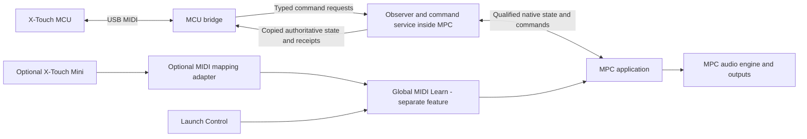

# MPC controller integration architecture

All runtime parts run on the MPC. The computer, SSH and VNC are development and
recovery tools, not dependencies for normal use. MPC continues to own audio,
project loading, plug-ins, automation and the musical state.

## Runtime owners

1. **Boot and session owner.** The systemd boot entry calls `mcu-session.sh`.
   It starts the matched observer, bridge and MIDI adapter, validates process
   identity and owns cleanup/recovery. A confirmed native New Project action
   permits a fresh app and controller session; generic crashes do not cause an
   uncontrolled restart loop. The package runs in place from the flashed image;
   a single development override can replace it only while it matches that image.
   Initial blank creation and saved-project import have separate qualified
   completion hooks; both publish into the same state service. The controller
   remains unavailable at Select Project until one completes.
2. **Native observer and command service.** `command-observer.so` loads inside
   MPC through `LD_PRELOAD`. Qualified hooks observe native track, mixer,
   parameter, transport and lifecycle activity. The app executable on disk is
   unchanged. The service copies state for the bridge and executes typed
   commands through qualified MPC owner paths. It checks target identity,
   lifetime and command completion rather than retaining arbitrary old pointers.
3. **MCU bridge.** `mirror-input` is a separate process. It interprets faders,
   encoders and buttons; owns controller banks/pages; submits native commands;
   and converts observed MPC state into motor positions, LED/ring states, LCD
   names/values/colors, meters and position feedback. Touchscreen and automation
   changes can therefore feed the controller without originating from it.
4. **Optional MIDI mapping adapter.** `mpclearn-controls` retains the Mini
   encoder-to-Q-Link route. It does not forward full X-Touch Play, Stop, Undo
   or Redo. Those commands go through the MCU bridge and native command service,
   along with the mixer and device controls. The Launch Control's direct global
   mapping is also separate. These optional mappings require Global MIDI Learn;
   MCU support does not. Global MIDI Learn remains a separate milestone, and
   the MCU image does not install or replace a user's learned profile.

Play and Stop are submitted to MPC's existing audio executor using its native
queue and retained holder. Completion is recorded after the audio callback
returns; calling the same responder directly on the UI thread was unsafe.

The observer and bridge communicate using bounded shared mapped state and a
command mailbox, in `volume.state` and `command.state`. The matched package records their
format versions. A request being submitted, called, applied and settled are
separate events. The service preserves that distinction when deciding whether
commands can be retired or motors can follow a value.

The integration does not process or reroute audio samples. It still consumes
CPU and interacts with MPC, so bounded callback/polling work and playback
performance remain requirements. Executable verification occurs at admission,
not repeatedly during performance. Motor following is change-driven with a
10 ms minimum send interval, touch protection and reversal protection; this
is not a guarantee of constant 100 Hz physical motion.

## Boundaries

This is a firmware-specific community extension for the qualified Live II
3.9.1 app, not an official Akai SDK or a complete API for every app operation.
Only decoded, qualified state/command paths are exposed. Device discovery and
color feedback currently target the full X-Touch; standard MCU messaging makes
other controllers feasible, not already supported. HUI remains unimplemented.

The boot entry survives normal reboot and is already user-tested. A firmware
update may replace it and requires compatibility checking before reinstallation.
The Mini is optional. VNC can remain stopped during music-making.

## MIDI input routing and Monitor visibility

In MPC Preferences > MIDI/Sync, turn off Track, Global and Control for the
`X-TOUCH_INT` input. The bridge receives the controller independently; disabling
these musical-input routes prevents MCU notes and pitchbend from reaching
instrument tracks. Leave other controllers and the X-Touch's external MIDI
ports configured for their intended use. This is MIDI port setup, not Global
MIDI Learn or a learned mapping requirement.

The integration does not hide controller messages from MPC's MIDI Monitor.
Those routing switches do not establish that the viewer suppresses messages.
A verified per-device viewer filter has not been established. Do not remove
ALSA subscriptions merely to reduce monitor clutter.

See [the complete X-Touch cheat sheet](xtouch-cheatsheet.md) and
[operation/startup guide](../controllers/program-observer/MCU-START.md).

See [performance measurements and constraints](performance.md) before changing
recurring bridge or observer work.
